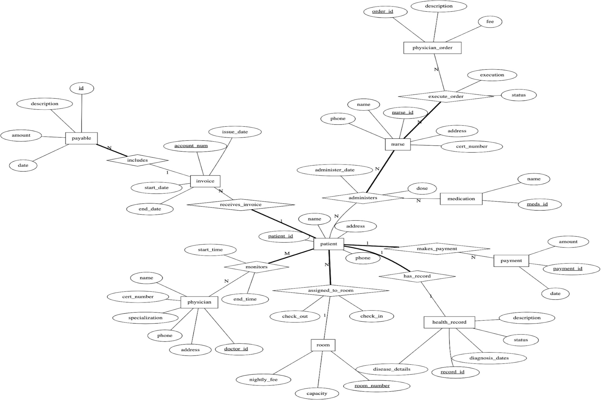

# Hospital Database System

This repository contains a full-stack relational database solution designed to manage hospital operations, including patient care, staff scheduling, medication tracking, and financial billing.

## Project Overview
The Hospital Database System is built on a normalized relational schema to ensure data integrity and minimize redundancy. The system supports complex healthcare workflows using advanced SQL features such as automated triggers for data validation and custom views for clinical reporting.

## Database Design

### Enhanced Entity-Relationship Diagram (EERD)
The system architecture was modeled to define the intricate relationships between Patients, Physicians, Nurses, and hospital infrastructure. It accounts for many-to-many relationships such as medication administration and nurse-order execution.



### Relational Schema
The conceptual design is mapped into 12 normalized tables to ensure 3NF compliance:
* **Core Entities:** `patient`, `physician`, `nurse`, `room`, `medication`.
* **Clinical Records:** `health_record`, `physician_order`, `monitors`.
* **Logistics & Actions:** `assigned_to_room`, `execute_order`, `administers`.
* **Finance:** `invoice`, `payable`, `payment`, `billed_item`.

## Implementation
The implementation scripts are organized in the `/Queries` folder:
* **Schema Definition:** Includes DDL scripts with comprehensive primary and foreign key constraints designed from scratch.
* **Data Population:** Contains custom DML scripts to populate the database with a functional dataset for testing and validation.
* **Advanced Logic:** Includes SQL Triggers for automatic data validation (e.g., enforcing default fees) and Views for streamlined administrative reporting.

## Analytical Queries & Insights
The following queries demonstrate the system's ability to extract actionable medical and administrative data from the relational model.

| Query ID | Objective | Technical Analysis |
| :--- | :--- | :--- |
| 1 | Room Assignment | Identifies the current room location for specific patients to coordinate facility logistics. |
| 2 | Medication Tracking | Lists all patients who have been treated with a specific medication for safety audits. |
| 3 | Physician Oversight | Maps patients to the specific physician currently responsible for their monitoring. |
| 4 | Capacity Analysis | Calculates the average patient capacity across all hospital rooms for occupancy planning. |
| 5 | Staff Workload | Measures nurse productivity by counting the total number of orders executed by each staff member. |
| 6 | Usage Statistics | Tracks the frequency of administration for every medication to manage inventory levels. |
| 7 | Patient Census | Generates a consolidated list of all patients currently assigned to a room. |
| 8 | Medical Team Mapping | Identifies the full team of doctors involved in a specific patient's care plan. |
| 9 | Advanced Filtering | Employs relational division to find patients who have received a complete set of treatments. |
| 10 | Staff Contact Info | Retrieves contact details for nurses associated with a specific patient’s treatment. |
| 11 | Financial Summary | Aggregates the total payments made by each individual patient for billing transparency. |
| 12 | Treatment Filtering | Filters patient records based on specific medication identifiers for clinical research. |
| 13 | Care Audit | Audits staff-patient interactions by listing patient details treated by a specific nurse. |
| 14 | Revenue Analysis | Identifies high-value transactions to monitor significant financial activity. |
| 15 | Clinical Status | Highlights patients with active medical conditions that require ongoing clinical attention. |

## Technical Highlights & Contributions
* **Full-Cycle Development:** Independently designed the EERD, mapped the relational schema, and implemented the database in MySQL.
* **Data Integrity:** Established strict foreign key constraints and normalization (3NF) to prevent data anomalies.
* **Custom Logic:** Authored custom triggers to automate default values for medical orders and payments, ensuring data consistency during manual entry.
* **Testing & Analysis:** Created a comprehensive suite of 15 queries to test the database's performance and ability to generate meaningful healthcare insights.

## Repository Structure
```text
├── Images/               # EERD Diagram and documentation visuals
├── Queries/              # SQL scripts for Schema, Data, and Analysis
└── README.md             # Project documentation
